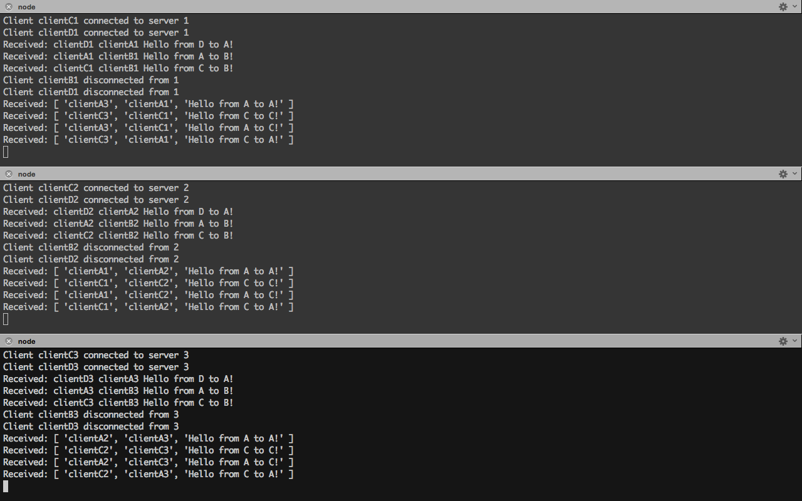
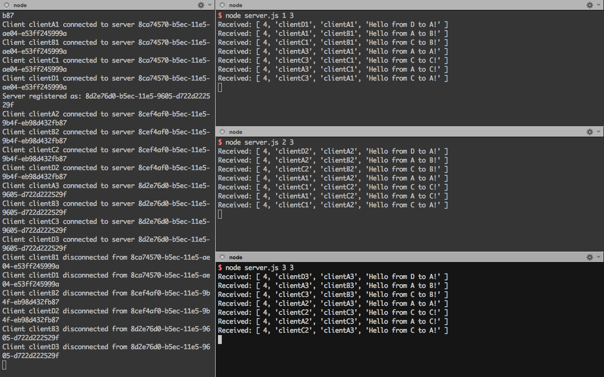

# Cluster Messaging

Proof of Concept for a simple messaging system in a cluster.

Implement a server to server messaging system using a Node.js broker connected to a Riak KV database.

## Architecture

### Server/Broker

```
+---------+   +------------+   +--------+   +---------------+   +-----------+
|         |   |            |   |        |   |               |   |           |
|  index  +---> TCP server +---> Router +---> Session Store +---> Datastore |
|         |   |            |   |        |   |               |   |           |
+---------+   +------------+   +---+----+   +---------------+   +-----------+
                                   |
                                   |
                                +--v---+
                                |      |
                                | Peer |
                                |      |
                                +------+
```

### Brokerless

```
+------------+   +--------+   +---------------+   +-----------+
|            |   |        |   |               |   |           |
| brokerless +---> Router +---> Session Store +---> Datastore |
|            |   |        |   |               |   |           |
+------------+   +---+----+   +---------------+   +-----------+
                     |
                     |
                  +--v---+
                  |      |
                  | Peer |
                  |      |
                  +------+
```


### Peer class

The Peer class exposes the following methods:
* `registerIdentity`: Assign the specified identity to the current peer.
* `connectClient`: Register the specified address to the active peer into the Session Store.
* `disconnectClient`: Unregister the specified address from the Session Store.
* `sendMessage`: Send a message to the specified address.

## Dependencies

```bash
npm install .
```

### Datastore

You can use one of the following datastore for the Session Store:
* Riak
* Redis
* Couchbase

#### Riak

```bash
git clone git@github.com:hectcastro/docker-riak.git
cd docker-riak
make start-cluster
```

#### Redis

```bash
docker run --name redis -p 6379:6379 -d redis
```

#### Couchbase

```bash
docker run --name couchbase --net=host -d couchbase/server:community
```

## Run

### Brokerless architecture

In several tabs:
```bash
node brokerless.js 1 3
node brokerless.js 2 3
node brokerless.js 3 3
```



### Server/Broker architecture

In several tabs:
```bash
# Start the broker
node index.js

## Start the servers
node server.js 1 3
node server.js 2 3
node server.js 3 3
```



## TODO

* Broadcast
